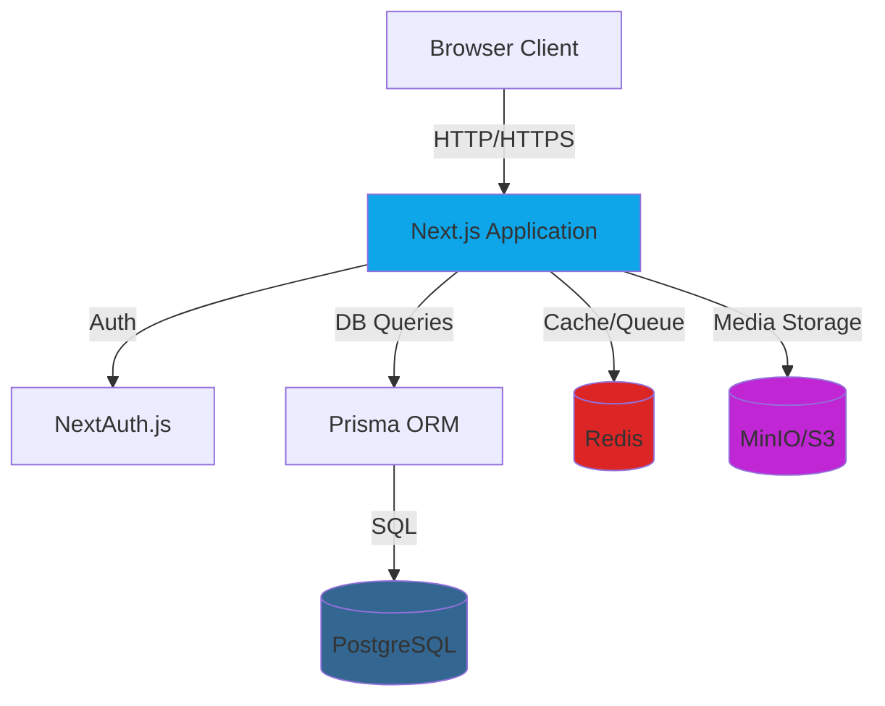
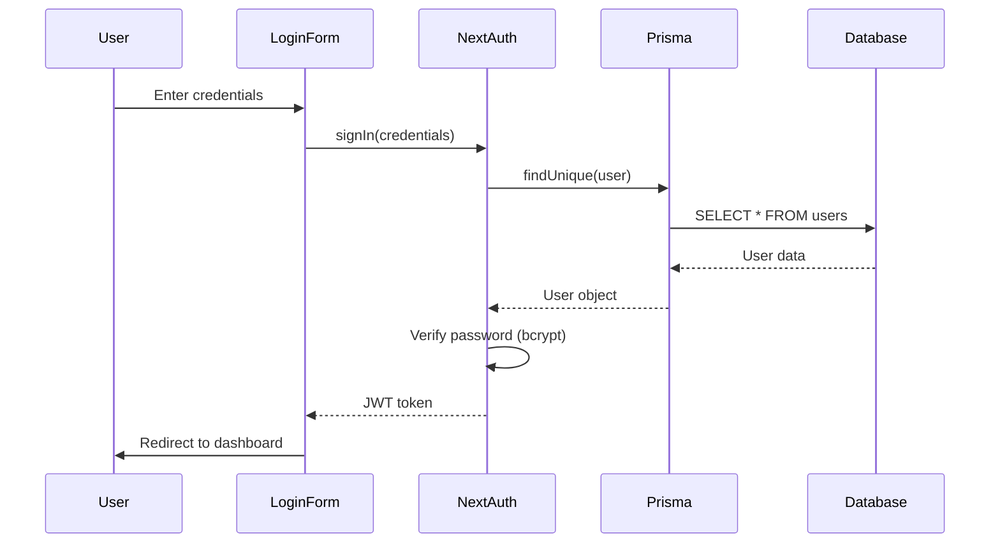
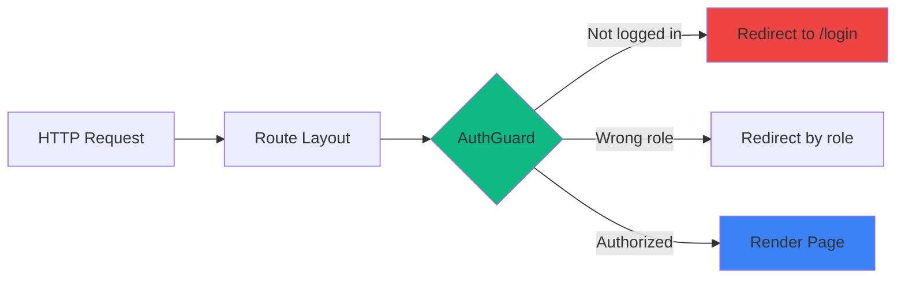
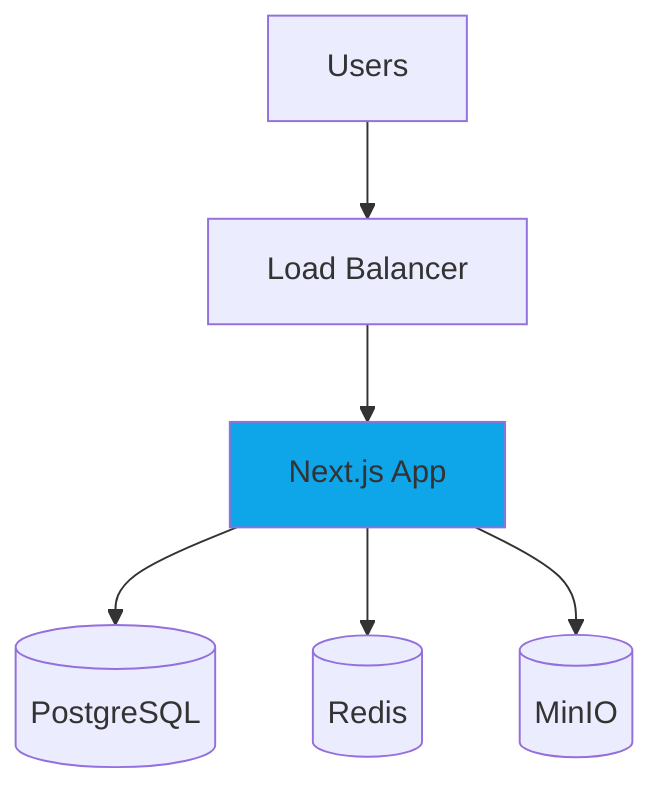
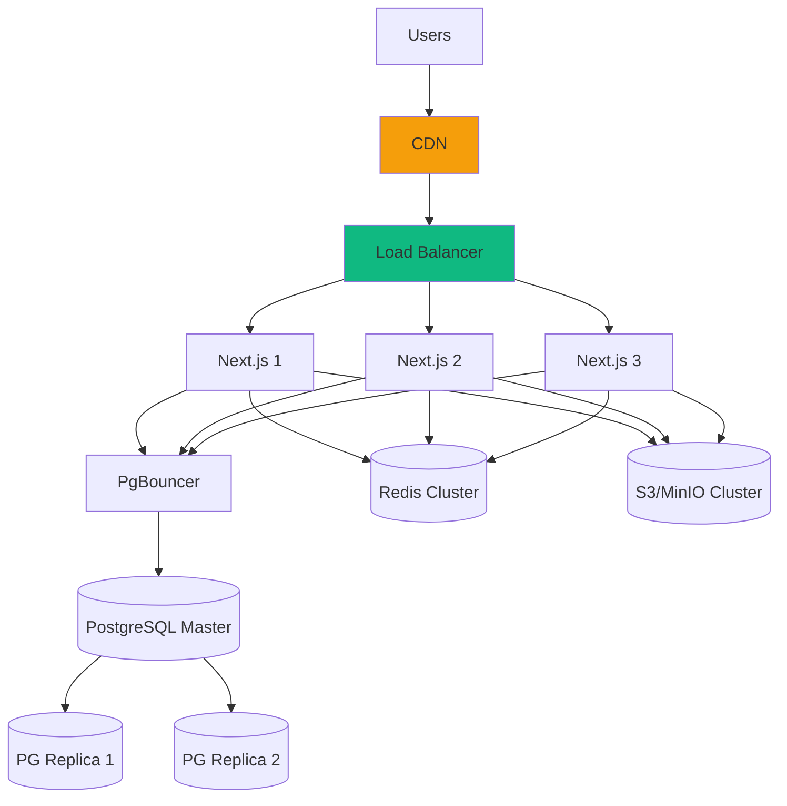

# 🏗️ Архитектура LMS системы

## Обзор

LMS (Learning Management System) - это full-stack веб-приложение для управления онлайн-обучением с поддержкой видео-лекций, тестов, заданий и сертификатов.

## Технологический стек

### Frontend
- **Next.js 16.0.3** - React framework (App Router)
- **React 19.2.0** - UI library
- **TypeScript 5.x** - Type safety
- **Tailwind CSS 4.x** - Styling
- **shadcn/ui** - UI components (Radix UI)
- **Lucide React** - Icons

### Backend
- **Next.js API Routes** - Backend API
- **Prisma 6.19.0** - ORM
- **PostgreSQL 16** - Primary database
- **NextAuth v5** - Authentication

### Infrastructure
- **Docker Compose** - Development environment
- **Redis 7** - Caching & queues
- **MinIO** - S3-compatible storage
- **Nginx** - Reverse proxy (production)

## Высокоуровневая архитектура



## Структура проекта

### App Router структура

```
app/
├── (auth)/                    # Auth group
│   ├── login/                 # Страница входа
│   └── signup/                # Страница регистрации
├── (dashboard)/               # Protected group
│   ├── dashboard/             # Общий дашборд
│   ├── admin/                 # Админ панель
│   ├── teacher/               # Кабинет преподавателя
│   └── student/               # Кабинет студента
├── api/
│   └── auth/[...nextauth]/    # NextAuth API
├── layout.tsx                 # Root layout
├── page.tsx                   # Home page
└── globals.css                # Global styles
```

### Компоненты

```
components/
├── ui/                        # shadcn/ui components
│   ├── button.tsx
│   ├── card.tsx
│   ├── input.tsx
│   └── ... (14 компонентов)
├── auth/
│   └── auth-guard.tsx         # Route protection
├── providers/
│   └── session-provider.tsx   # NextAuth provider
├── login-form.tsx             # Login form
├── signup-form.tsx            # Signup form
└── app-sidebar.tsx            # Main sidebar
```

### Библиотеки

```
lib/
├── auth.ts                    # NextAuth config
├── auth-helpers.ts            # Auth utilities
├── prisma.ts                  # Prisma client
└── utils.ts                   # General utilities
```

## Data Flow

### Аутентификация



### Защита роутов



## Безопасность

### Защита на уровне роутов

**Через AuthGuard компонент:**
```typescript
// app/admin/layout.tsx
<AuthGuard allowedRoles={[UserRole.ADMIN]}>
  {children}
</AuthGuard>
```

### Защита API

**Через auth helpers:**
```typescript
// app/api/courses/route.ts
import { requireRole } from '@/lib/auth-helpers';

export async function POST() {
  const user = await requireRole([UserRole.TEACHER, UserRole.ADMIN]);
  // ... API logic
}
```

### Безопасность данных

- **Passwords:** bcrypt hashing (10 rounds)
- **Sessions:** JWT with HttpOnly cookies
- **CSRF:** NextAuth built-in protection
- **SQL Injection:** Prisma parameterized queries
- **XSS:** React automatic escaping

## Масштабирование

### Текущая архитектура (Single Server)



### Будущая архитектура (Distributed)



## Производительность

### Оптимизации

1. **Database:**
   - Indexes на часто запрашиваемые поля
   - Connection pooling (Prisma)
   - Query optimization

2. **Caching:**
   - Redis для сессий
   - ISR для статических страниц
   - CDN для медиа файлов

3. **Frontend:**
   - Code splitting (Next.js автоматически)
   - Image optimization (next/image)
   - Lazy loading компонентов

4. **API:**
   - Rate limiting (будущее)
   - Response compression
   - Database query batching

## Паттерны проектирования

### Server Components (RSC)

Используются для:
- Layout компонентов
- Data fetching на сервере
- AuthGuard проверок
- Static rendering

### Client Components

Используются для:
- Интерактивные формы
- State management (useState, useReducer)
- Event handlers
- Browser APIs

### Repository Pattern

```typescript
// lib/repositories/course.repository.ts
export class CourseRepository {
  async findById(id: string) {
    return prisma.course.findUnique({ where: { id } });
  }

  async create(data: CreateCourseDto) {
    return prisma.course.create({ data });
  }
}
```

### Service Layer

```typescript
// lib/services/course.service.ts
export class CourseService {
  constructor(private repo: CourseRepository) {}

  async createCourse(data: CreateCourseDto, teacherId: string) {
    // Business logic
    return this.repo.create({ ...data, teacherId });
  }
}
```

## Мониторинг и логирование

### Планируется

- **Sentry** - Error tracking
- **Prometheus** - Metrics
- **Grafana** - Dashboards
- **Winston/Pino** - Logging
- **Healthcheck endpoints** - System health

## Deployment

### Development
```bash
docker-compose up -d     # Start services
npm run dev              # Start Next.js
```

### Production
```bash
docker build -t lms .    # Build image
docker-compose -f docker-compose.prod.yml up -d
```

## Roadmap

### Этап 1: Фундамент ✅
- Docker setup
- Database schema
- Authentication
- Basic UI

### Этап 2: Core Features 🚧
- CRUD API для курсов
- Video upload/processing
- Course management UI

### Этап 3: Advanced Features
- Tests & Assignments
- Analytics
- Certificates

### Этап 4: Scale & Polish
- Performance optimization
- CI/CD pipeline
- Monitoring
- Documentation

---

**Дата обновления:** 25 ноября 2025
