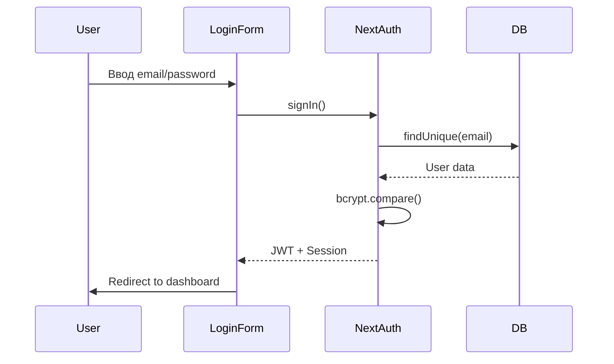
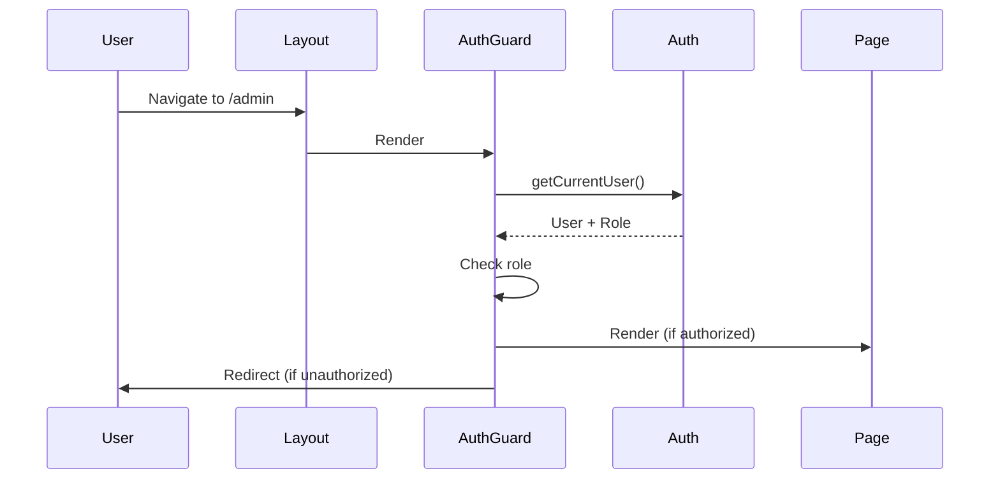

# 🔐 Аутентификация и Авторизация

## Обзор

LMS использует **NextAuth.js v5** для аутентификации с JWT стратегией и role-based access control (RBAC).

## Провайдеры

### 1. Credentials Provider (Email/Password)

**Файл:** `lib/auth.ts`

```typescript
CredentialsProvider({
  credentials: {
    email: { type: "email" },
    password: { type: "password" }
  },
  async authorize(credentials) {
    // 1. Найти пользователя по email
    const user = await prisma.user.findUnique({
      where: { email: credentials.email }
    });

    // 2. Проверить пароль с bcrypt
    const isValid = await bcrypt.compare(
      credentials.password,
      user.password
    );

    // 3. Вернуть пользователя
    return { id, email, name, role, image };
  }
})
```

### 2. Google OAuth Provider

```typescript
GoogleProvider({
  clientId: process.env.GOOGLE_CLIENT_ID,
  clientSecret: process.env.GOOGLE_CLIENT_SECRET
})
```

## Роли пользователей

```typescript
enum UserRole {
  ADMIN     // Полный доступ
  TEACHER   // Создание курсов, проверка заданий
  STUDENT   // Просмотр курсов, сдача заданий
}
```

### Иерархия прав

```
ADMIN > TEACHER > STUDENT
```

**ADMIN** может:
- Всё что может TEACHER
- Управлять пользователями
- Просматривать аналитику всей системы
- Модерировать контент

**TEACHER** может:
- Создавать и редактировать курсы
- Загружать видео
- Создавать тесты и задания
- Проверять работы студентов
- Просматривать прогресс своих студентов

**STUDENT** может:
- Просматривать опубликованные курсы
- Записываться на курсы
- Просматривать видео
- Сдавать задания и тесты
- Получать сертификаты

## Защита роутов (Pages)

### AuthGuard Component

**Файл:** `components/auth/auth-guard.tsx`

```typescript
export async function AuthGuard({
  children,
  allowedRoles,
  redirectTo = "/login"
}: AuthGuardProps) {
  const user = await getCurrentUser();

  // Проверка авторизации
  if (!user) {
    redirect(redirectTo);
  }

  // Проверка роли
  if (allowedRoles && !allowedRoles.includes(user.role)) {
    // Редирект по роли
    if (user.role === UserRole.ADMIN) redirect("/admin");
    else if (user.role === UserRole.TEACHER) redirect("/teacher");
    else redirect("/student");
  }

  return <>{children}</>;
}
```

### Использование в Layouts

```typescript
// app/admin/layout.tsx
export default function AdminLayout({ children }) {
  return (
    <AuthGuard allowedRoles={[UserRole.ADMIN]}>
      {children}
    </AuthGuard>
  );
}

// app/teacher/layout.tsx
export default function TeacherLayout({ children }) {
  return (
    <AuthGuard allowedRoles={[UserRole.TEACHER, UserRole.ADMIN]}>
      {children}
    </AuthGuard>
  );
}
```

## Защита API Routes

### Helper Functions

**Файл:** `lib/auth-helpers.ts`

```typescript
// Получить текущего пользователя
export async function getCurrentUser() {
  const session = await auth();
  return session?.user;
}

// Требовать авторизацию
export async function requireAuth() {
  const user = await getCurrentUser();
  if (!user) throw new Error("Unauthorized");
  return user;
}

// Требовать определённую роль
export async function requireRole(roles: UserRole | UserRole[]) {
  const user = await requireAuth();
  const allowedRoles = Array.isArray(roles) ? roles : [roles];

  if (!allowedRoles.includes(user.role)) {
    throw new Error("Forbidden");
  }

  return user;
}

// Проверки ролей
export async function isAdmin() {
  const user = await getCurrentUser();
  return user?.role === UserRole.ADMIN;
}

export async function isTeacher() {
  const user = await getCurrentUser();
  return user?.role === UserRole.TEACHER || user?.role === UserRole.ADMIN;
}
```

### Использование в API Routes

```typescript
// app/api/courses/route.ts
import { requireRole } from "@/lib/auth-helpers";
import { UserRole } from "@prisma/client";

export async function POST(request: Request) {
  // Только TEACHER или ADMIN
  const user = await requireRole([UserRole.TEACHER, UserRole.ADMIN]);

  const body = await request.json();

  const course = await prisma.course.create({
    data: {
      ...body,
      teacherId: user.id
    }
  });

  return Response.json(course);
}
```

## Callbacks

### JWT Callback

Добавляет `id` и `role` в JWT токен.

```typescript
async jwt({ token, user }) {
  if (user) {
    token.id = user.id;
    token.role = user.role;
  }
  return token;
}
```

### Session Callback

Добавляет `id` и `role` в объект сессии.

```typescript
async session({ session, token }) {
  if (session.user) {
    session.user.id = token.id as string;
    session.user.role = token.role as UserRole;
  }
  return session;
}
```

## TypeScript типизация

**Файл:** `types/next-auth.d.ts`

```typescript
declare module "next-auth" {
  interface Session {
    user: {
      id: string;
      role: UserRole;
    } & DefaultSession["user"];
  }

  interface User {
    role: UserRole;
  }
}

declare module "next-auth/jwt" {
  interface JWT {
    id: string;
    role: UserRole;
  }
}
```

## Client-side Usage

### useSession Hook

```typescript
"use client";
import { useSession } from "next-auth/react";

export function Profile() {
  const { data: session, status } = useSession();

  if (status === "loading") return <div>Loading...</div>;
  if (status === "unauthenticated") return <div>Not signed in</div>;

  return (
    <div>
      <p>Signed in as {session.user.email}</p>
      <p>Role: {session.user.role}</p>
    </div>
  );
}
```

### signIn/signOut

```typescript
import { signIn, signOut } from "next-auth/react";

// Login
await signIn("credentials", {
  email: "admin@lms.ru",
  password: "admin123",
  callbackUrl: "/dashboard"
});

// Login with Google
await signIn("google", {
  callbackUrl: "/dashboard"
});

// Logout
await signOut({ callbackUrl: "/" });
```

## Server-side Usage

### Server Components

```typescript
import { auth } from "@/lib/auth";

export default async function Page() {
  const session = await auth();

  if (!session) {
    redirect("/login");
  }

  return <div>Welcome {session.user.name}</div>;
}
```

### Server Actions

```typescript
"use server";
import { requireRole } from "@/lib/auth-helpers";

export async function createCourse(data: FormData) {
  const user = await requireRole(UserRole.TEACHER);

  // Create course logic...
}
```

## Безопасность

### Password Hashing

**bcrypt** с 10 rounds:
```typescript
import bcrypt from "bcryptjs";

const hashedPassword = await bcrypt.hash(password, 10);
const isValid = await bcrypt.compare(password, hashedPassword);
```

### JWT Tokens

- **Алгоритм:** HS256
- **Secret:** NEXTAUTH_SECRET (32+ символов)
- **Expiry:** 30 дней
- **Storage:** HttpOnly cookies

### CSRF Protection

NextAuth автоматически защищает от CSRF атак.

## Переменные окружения

```bash
# .env
NEXTAUTH_URL="http://localhost:3000"
NEXTAUTH_SECRET="generate-with-openssl-rand-base64-32"

# Google OAuth (опционально)
GOOGLE_CLIENT_ID="your-google-client-id"
GOOGLE_CLIENT_SECRET="your-google-client-secret"
```

### Генерация SECRET

```bash
openssl rand -base64 32
```

## Flow диаграммы

### Login Flow



### Protected Route Flow



## Troubleshooting

### "Unauthorized" при наличии сессии

Проверь, что `auth()` импортируется из правильного места:
```typescript
import { auth } from "@/lib/auth"; // ✅ Правильно
import { auth } from "next-auth"; // ❌ Неправильно
```

### Роль не передаётся в сессию

Убедись что callbacks настроены и типы расширены.

### Google OAuth не работает

1. Проверь GOOGLE_CLIENT_ID и GOOGLE_CLIENT_SECRET
2. Убедись что redirect URI правильный в Google Console
3. Добавь домен в authorized domains

---

**Дата обновления:** 25 ноября 2025
