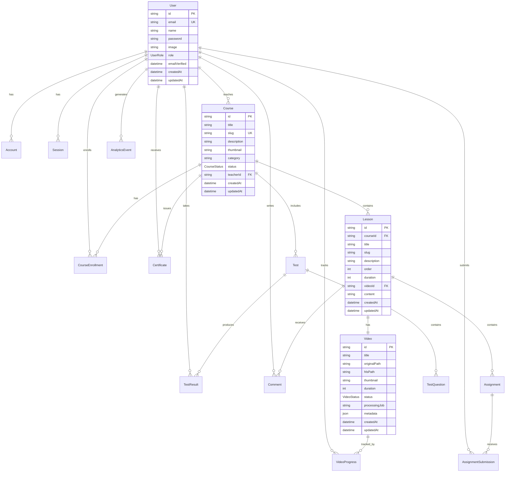

# 🗄️ База данных LMS системы

## Обзор

База данных построена на **PostgreSQL 16** с использованием **Prisma ORM**.

**Всего таблиц:** 15
**Enum типов:** 4

## ER Диаграмма



## Таблицы и поля

### 👤 User (users)

Основная таблица пользователей системы.

| Поле | Тип | Описание |
|------|-----|----------|
| id | String (PK) | Уникальный идентификатор (cuid) |
| email | String (Unique) | Email пользователя |
| name | String? | Полное имя |
| password | String? | Хеш пароля (bcrypt) |
| image | String? | URL аватара |
| role | UserRole | Роль: ADMIN, TEACHER, STUDENT |
| emailVerified | DateTime? | Дата верификации email |
| createdAt | DateTime | Дата создания |
| updatedAt | DateTime | Дата обновления |

**Связи:**
- `accounts` → Account[] (OAuth аккаунты)
- `sessions` → Session[] (Активные сессии)
- `coursesTeaching` → Course[] (Преподаваемые курсы)
- `enrollments` → CourseEnrollment[] (Записи на курсы)
- `videoProgress` → VideoProgress[] (Прогресс просмотра)
- `assignments` → AssignmentSubmission[] (Сданные задания)
- `testResults` → TestResult[] (Результаты тестов)
- `comments` → Comment[] (Комментарии)
- `certificates` → Certificate[] (Сертификаты)
- `analyticsEvents` → AnalyticsEvent[] (События аналитики)

**Индексы:**
- Unique на `email`

---

### 🔑 Account (accounts)

OAuth аккаунты для NextAuth.

| Поле | Тип | Описание |
|------|-----|----------|
| id | String (PK) | Уникальный ID |
| userId | String (FK) | ID пользователя |
| type | String | Тип аккаунта (oauth, email) |
| provider | String | Провайдер (google, credentials) |
| providerAccountId | String | ID в системе провайдера |
| refresh_token | String? | Refresh token |
| access_token | String? | Access token |
| expires_at | Int? | Время истечения токена |
| token_type | String? | Тип токена |
| scope | String? | OAuth scopes |
| id_token | String? | ID token |
| session_state | String? | Session state |

**Связи:**
- `user` → User (Владелец аккаунта)

**Индексы:**
- Unique на `[provider, providerAccountId]`

---

### 📚 Course (courses)

Курсы в системе.

| Поле | Тип | Описание |
|------|-----|----------|
| id | String (PK) | Уникальный ID |
| title | String | Название курса |
| slug | String (Unique) | URL-friendly slug |
| description | String? | Описание курса |
| thumbnail | String? | Путь к обложке |
| category | String? | Категория курса |
| status | CourseStatus | DRAFT, PUBLISHED, ARCHIVED |
| teacherId | String (FK) | ID преподавателя |
| createdAt | DateTime | Дата создания |
| updatedAt | DateTime | Дата обновления |

**Связи:**
- `teacher` → User (Преподаватель)
- `lessons` → Lesson[] (Уроки курса)
- `enrollments` → CourseEnrollment[] (Записи студентов)
- `tests` → Test[] (Тесты курса)
- `certificates` → Certificate[] (Сертификаты)

**Индексы:**
- Unique на `slug`
- Index на `teacherId`
- Index на `status`

---

### 📝 Lesson (lessons)

Уроки в курсах.

| Поле | Тип | Описание |
|------|-----|----------|
| id | String (PK) | Уникальный ID |
| courseId | String (FK) | ID курса |
| title | String | Название урока |
| slug | String | URL-friendly slug |
| description | String? | Описание |
| order | Int | Порядок в курсе (default: 0) |
| duration | Int? | Длительность в секундах |
| videoId | String? (FK) | ID видео (опционально) |
| content | String? | Текстовый контент (Markdown) |
| createdAt | DateTime | Дата создания |
| updatedAt | DateTime | Дата обновления |

**Связи:**
- `course` → Course (Родительский курс)
- `video` → Video? (Видео урока)
- `assignments` → Assignment[] (Домашние задания)
- `comments` → Comment[] (Комментарии)

**Индексы:**
- Unique на `[courseId, slug]`
- Index на `courseId`

---

### 🎥 Video (videos)

Видео файлы.

| Поле | Тип | Описание |
|------|-----|----------|
| id | String (PK) | Уникальный ID |
| title | String | Название видео |
| originalPath | String | Путь к оригиналу в MinIO |
| hlsPath | String? | Путь к HLS плейлисту |
| thumbnail | String? | Путь к превью |
| duration | Int? | Длительность в секундах |
| status | VideoStatus | UPLOADING, PROCESSING, READY, FAILED |
| processingJob | String? | ID job'а обработки |
| metadata | Json? | Доп. метаданные (размер, codec) |
| createdAt | DateTime | Дата создания |
| updatedAt | DateTime | Дата обновления |

**Связи:**
- `lesson` → Lesson? (Урок с этим видео)
- `progress` → VideoProgress[] (Прогресс просмотра)

---

### 📊 VideoProgress (video_progress)

Прогресс просмотра видео студентами.

| Поле | Тип | Описание |
|------|-----|----------|
| id | String (PK) | Уникальный ID |
| videoId | String (FK) | ID видео |
| userId | String (FK) | ID пользователя |
| position | Int | Позиция в секундах (default: 0) |
| completed | Boolean | Просмотрено полностью (default: false) |
| lastWatched | DateTime | Последний просмотр |

**Связи:**
- `video` → Video
- `user` → User

**Индексы:**
- Unique на `[videoId, userId]`
- Index на `userId`

---

### 📋 Assignment (assignments)

Домашние задания.

| Поле | Тип | Описание |
|------|-----|----------|
| id | String (PK) | Уникальный ID |
| lessonId | String (FK) | ID урока |
| title | String | Название задания |
| description | String | Описание |
| dueDate | DateTime? | Срок сдачи |
| maxScore | Int | Макс. баллы (default: 100) |
| createdAt | DateTime | Дата создания |
| updatedAt | DateTime | Дата обновления |

**Связи:**
- `lesson` → Lesson
- `submissions` → AssignmentSubmission[]

**Индексы:**
- Index на `lessonId`

---

### ✅ AssignmentSubmission (assignment_submissions)

Сдача заданий студентами.

| Поле | Тип | Описание |
|------|-----|----------|
| id | String (PK) | Уникальный ID |
| assignmentId | String (FK) | ID задания |
| studentId | String (FK) | ID студента |
| content | String | Ответ студента |
| attachments | String[] | Массив путей к файлам |
| status | AssignmentStatus | PENDING, SUBMITTED, GRADED |
| score | Int? | Оценка |
| feedback | String? | Отзыв преподавателя |
| submittedAt | DateTime | Дата сдачи |
| gradedAt | DateTime? | Дата проверки |

**Связи:**
- `assignment` → Assignment
- `student` → User

**Индексы:**
- Unique на `[assignmentId, studentId]`
- Index на `studentId`

---

### 📝 Test (tests)

Тесты.

| Поле | Тип | Описание |
|------|-----|----------|
| id | String (PK) | Уникальный ID |
| courseId | String (FK) | ID курса |
| title | String | Название теста |
| description | String? | Описание |
| timeLimit | Int? | Лимит времени (минуты) |
| passingScore | Int | Проходной балл % (default: 70) |
| createdAt | DateTime | Дата создания |
| updatedAt | DateTime | Дата обновления |

**Связи:**
- `course` → Course
- `questions` → TestQuestion[]
- `results` → TestResult[]

**Индексы:**
- Index на `courseId`

---

### ❓ TestQuestion (test_questions)

Вопросы тестов.

| Поле | Тип | Описание |
|------|-----|----------|
| id | String (PK) | Уникальный ID |
| testId | String (FK) | ID теста |
| question | String | Текст вопроса |
| options | Json | Массив вариантов ответа |
| correctAnswer | Json | Правильный ответ (index или массив) |
| points | Int | Баллы за вопрос (default: 1) |
| order | Int | Порядок вопроса (default: 0) |
| createdAt | DateTime | Дата создания |

**Связи:**
- `test` → Test

**Индексы:**
- Index на `testId`

---

### 🎯 TestResult (test_results)

Результаты тестов.

| Поле | Тип | Описание |
|------|-----|----------|
| id | String (PK) | Уникальный ID |
| testId | String (FK) | ID теста |
| studentId | String (FK) | ID студента |
| answers | Json | Массив ответов |
| score | Int | Набранные баллы |
| maxScore | Int | Максимальные баллы |
| percentage | Float | Процент правильных |
| passed | Boolean | Тест пройден (default: false) |
| completedAt | DateTime | Дата завершения |

**Связи:**
- `test` → Test
- `student` → User

**Индексы:**
- Index на `testId`
- Index на `studentId`

---

### 💬 Comment (comments)

Комментарии к урокам.

| Поле | Тип | Описание |
|------|-----|----------|
| id | String (PK) | Уникальный ID |
| lessonId | String (FK) | ID урока |
| userId | String (FK) | ID автора |
| content | String | Текст комментария |
| createdAt | DateTime | Дата создания |
| updatedAt | DateTime | Дата обновления |

**Связи:**
- `lesson` → Lesson
- `user` → User

**Индексы:**
- Index на `lessonId`
- Index на `userId`

---

### 🎓 Certificate (certificates)

Сертификаты об окончании курсов.

| Поле | Тип | Описание |
|------|-----|----------|
| id | String (PK) | Уникальный ID |
| courseId | String (FK) | ID курса |
| studentId | String (FK) | ID студента |
| certificateNumber | String (Unique) | Номер сертификата |
| issuedAt | DateTime | Дата выдачи |
| pdfPath | String? | Путь к PDF в MinIO |

**Связи:**
- `course` → Course
- `student` → User

**Индексы:**
- Unique на `certificateNumber`
- Unique на `[courseId, studentId]`
- Index на `studentId`

---

### 📈 AnalyticsEvent (analytics_events)

События для аналитики.

| Поле | Тип | Описание |
|------|-----|----------|
| id | String (PK) | Уникальный ID |
| userId | String? (FK) | ID пользователя (опционально) |
| eventType | String | Тип события (page_view, video_play и т.д.) |
| eventData | Json? | Дополнительные данные |
| occurredAt | DateTime | Время события |

**Связи:**
- `user` → User?

**Индексы:**
- Index на `userId`
- Index на `eventType`
- Index на `occurredAt`

---

## Enum типы

### UserRole
```prisma
enum UserRole {
  ADMIN       // Администратор системы
  TEACHER     // Преподаватель
  STUDENT     // Студент
}
```

### CourseStatus
```prisma
enum CourseStatus {
  DRAFT       // Черновик
  PUBLISHED   // Опубликован
  ARCHIVED    // Архивирован
}
```

### VideoStatus
```prisma
enum VideoStatus {
  UPLOADING   // Загружается
  PROCESSING  // Обрабатывается (FFmpeg)
  READY       // Готово к просмотру
  FAILED      // Ошибка обработки
}
```

### AssignmentStatus
```prisma
enum AssignmentStatus {
  PENDING     // Ожидает сдачи
  SUBMITTED   // Сдано
  GRADED      // Проверено
}
```

---

## Миграции

### Создание миграции
```bash
npx prisma migrate dev --name migration_name
```

### Применение миграций (production)
```bash
npx prisma migrate deploy
```

### Сброс БД (осторожно!)
```bash
npx prisma migrate reset
```

## Seed данные

Файл: `prisma/seed.ts`

**Создаёт:**
- 3 пользователя (admin, teacher, student)
- 1 тестовый курс
- 3 урока
- 1 тест с 3 вопросами
- 1 запись студента на курс

**Запуск:**
```bash
npx prisma db seed
```

---

**Дата обновления:** 25 ноября 2025
